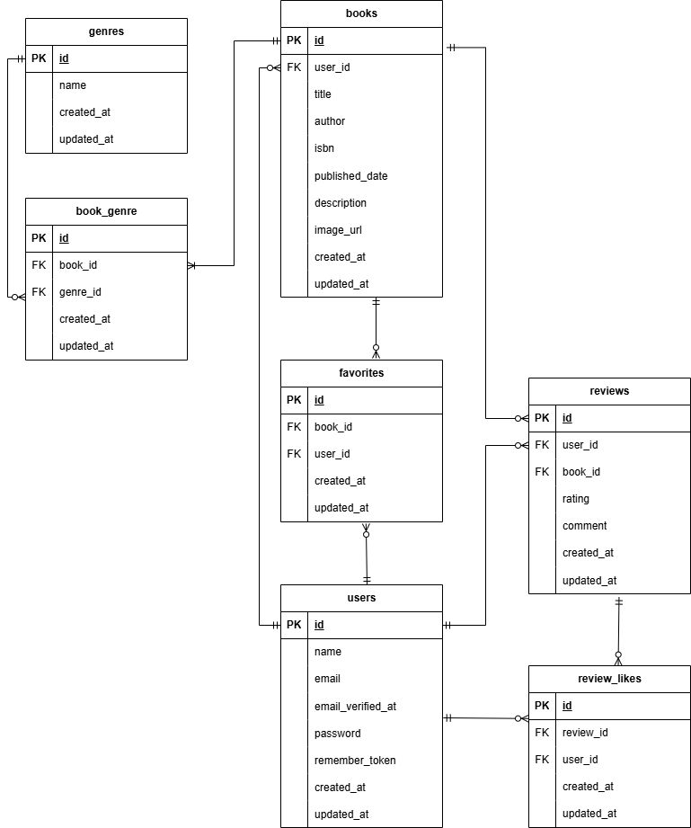

# BookShelf 書籍レビューアプリ

## 作成者
竹村 麻紀

## 概要
BookShelfは、ユーザーが書籍を登録・閲覧し、レビューを投稿できる書籍レビューアプリです。
ジャンルによる分類、レビューへのいいね、ランキング表示などの機能を備えています。
また、外部アプリケーション向けの公開API（JSON）も提供しています。

## 使用技術
### バックエンド
- PHP 8.5
- Laravel 10.x
- Laravel Fortify

### データベース
- MySQL 8.4

### フロントエンド
- Vite
- Tailwind CSS ^3.4.0
- @tailwindcss/forms
- Alpine.js

### 開発環境
- Docker
- Laravel Sail
- phpMyAdmin

## 動作環境
- Docker
- Docker Compose
> ※Windowsの場合はWSL2の利用を推奨します。

## 環境構築手順
### 1. リポジトリをクローン

```bash
git clone https://github.com/maki-takemura/bookshelf-app.git
cd bookshelf-app
```

＜追記予定＞

## 開発環境URL

- http://localhost

## テスト実行手順
本プロジェクトではPHPUnitを使用してテストを実施します。

### 確認事項

- テストがすべて成功すること
- テストカバレッジが80%以上であること

### テスト実行

```bash
sail artisan test
```
### カバレッジ確認

```bash
sail artisan test --coverage
```

## ER図



## 機能一覧

後日追加予定

## APIエンドポイント一覧

後日追加予定

