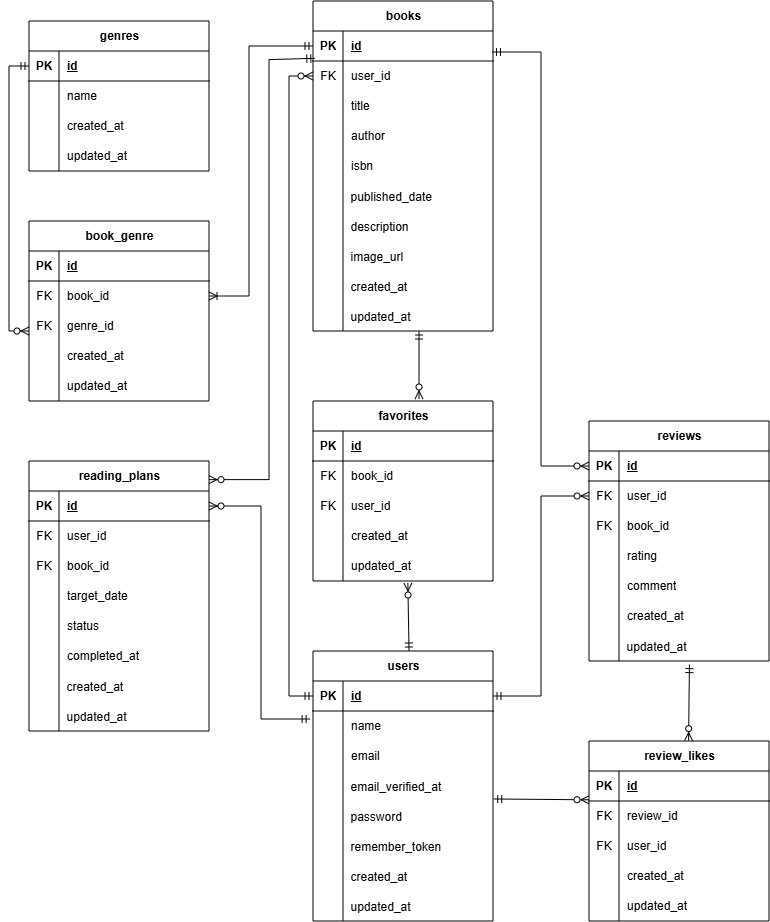

# BookShelf 書籍レビューアプリ

BookShelfは、ユーザーが書籍を登録・閲覧し、レビューや読書計画を管理できる書籍レビューアプリです。
ジャンル分類、書籍のお気に入り登録、レビューへのいいね、ランキング表示、キーワード検索・ジャンル別絞り込み、ISBN検索による書籍情報の自動取得、読書レポート、リマインダー通知などの機能を備えています。
また、外部アプリケーション向けに、Laravel Sanctumによる認証機能を備えたAPI（JSON）も提供しています。

## 作成者

竹村 麻紀

## 使用技術

### バックエンド

- PHP 8.5
- Laravel 10.x
- Laravel Fortify（認証）
- Laravel Sanctum（認証）

### データベース

- MySQL 8.4

### フロントエンド

- Vite
- Tailwind CSS ^3.4.0
- @tailwindcss/forms
- Alpine.js

### 外部API

- Google Books API

### 開発環境

- Docker
- Laravel Sail
- phpMyAdmin

## ER図



## 開発環境URL

- http://localhost

## 動作環境

- Docker
- Docker Compose
> ※Windowsの場合はWSL2の利用を推奨します。

## 環境構築手順

### 1. リポジトリをクローン

以下のコマンドで任意のディレクトリにリポジトリをクローンします。

```bash
git clone https://github.com/maki-takemura/bookshelf-app.git
cd bookshelf-app
```

### 2. envファイルの準備

`.env.example`をコピーして`.env`を作成します。

```bash
cp .env.example .env
```

`.env`ファイル内の以下のDB接続情報を確認・設定します。
Sailを使用するため、以下のように変更してください。

```bash
DB_CONNECTION=mysql
DB_HOST=mysql
DB_PORT=3306
DB_DATABASE=laravel
DB_USERNAME=sail
DB_PASSWORD=password
```

Google Books APIとの実通信を確認する場合は、Google Books APIキーを取得し、`.env`に以下の環境変数を設定してください。

```bash
GOOGLE_BOOKS_API_KEY=取得したAPIキー
```
※Google Books APIとの実通信を行わない場合、APIキーの設定は不要です。

※APIキーの取得方法は[Google Books APIの公式ドキュメント](https://developers.google.com/books/docs/v1/using)を参照してください。

### 3. Composer依存パッケージのインストール

初回セットアップ時は`vendor`ディレクトリが存在しないため、以下のDockerコマンドで`composer install`を実行します。

```bash
docker run --rm \
    -u "$(id -u):$(id -g)" \
    -v "$(pwd):/var/www/html" \
    -w /var/www/html \
    composer:latest \
    composer install --ignore-platform-reqs
```

### 4. Laravel Sailの起動

以下のコマンドでDockerコンテナを起動します。

```bash
./vendor/bin/sail up -d
```

> ※以降の手順で`sail`コマンドを使用するため、以下のエイリアスを設定してください。

- Bash（Linux）の場合:
```bash
echo "alias sail='[ -f sail ] && bash sail || bash vendor/bin/sail'" >> ~/.bashrc
exec $SHELL
```

- Zsh（Mac）の場合:
```bash
echo "alias sail='[ -f sail ] && bash sail || bash vendor/bin/sail'" >> ~/.zshrc
exec $SHELL
```

### 5. アプリケーションキーの作成

以下のコマンドでアプリケーションキーを作成します。

```bash
sail artisan key:generate
```

### 6. データベースのマイグレーションと初期データ投入

以下のコマンドでテーブルを作成し、ダミーデータを投入します。

```bash
sail artisan migrate:fresh --seed
```

#### マイグレーション実行時にデータベースのアクセスエラーが発生した場合

既存のDockerボリュームに以前のデータベース設定が残っている場合、マイグレーション実行時に`Access denied`エラーが発生することがあります。

その場合は、以下のコマンドを順に実行してください。

> ※`sail down -v`を実行すると、本プロジェクトのDockerボリュームと保存されているデータベースのデータが削除されます。

```bash
sail down -v
sail up -d
```

MySQLコンテナが起動するまで30秒程度待ってから、再度マイグレーションと初期データ投入を実行してください。

```bash
sail artisan migrate:fresh --seed
```

### 7. フロントエンド環境の準備

以下のコマンドでフロントエンドの依存パッケージをインストールし、開発サーバーを起動します。

```bash
sail npm install
sail npm run dev
```

※`npm run dev`は開発中起動したままにする必要があります。別ターミナルで実行してください。

### 8. アプリケーションへのアクセス

ブラウザで http://localhost にアクセスします。

### 9. テストユーザーでのログイン

Seederにより、動作確認用のユーザーが作成されます。

| 名前 | メールアドレス | パスワード |
| --- | --- | --- |
| 山田太郎 | `yamada@example.com` | `password` |

ブラウザで http://localhost/login にアクセスし、上記の情報でログインしてください。

### 10. Google Books APIとの実通信確認

Google Books APIキーを設定した場合は、以下の手順で実通信を確認できます。

1. アプリケーションを起動する
2. ISBN検索画面を開く
3. 存在するISBN（例：`9784297132347`）を入力する
4. Google Books APIから取得した書籍情報が表示されることを確認する

## テスト実行手順
本プロジェクトではPHPUnitを使用してテストを実施します。

### 確認事項

- テストがすべて成功すること
- テストカバレッジが80%以上であること

### テスト実行

```bash
sail artisan test
```
### カバレッジ確認

```bash
sail artisan test --coverage
```

### Google Books APIを利用するテストについて

Google Books API連携のFeatureテストでは、`Http::fake()`を利用して外部APIとの通信をモック化しています。

そのため、Featureテストの実行にGoogle Books APIキーの設定は不要です。

## 定期実行処理の確認

読書計画の期限切れ更新およびリマインダー通知は、毎日20時に実行されるようスケジュールされています。

### 通知スケジュールの登録確認

以下のコマンドで、スケジュールの登録内容を確認できます。

```bash
sail artisan schedule:list
```

### 期限切れ更新・リマインダー通知の手動実行

以下のコマンドで、期限切れ更新およびリマインダー通知の処理を手動実行できます。

```bash
sail artisan app:process-reading-plan-reminders
```

Seederには通知対象となる読書計画が含まれています。手動実行後、山田太郎のアカウントでログインすると、通知一覧画面で作成された通知を確認できます。

### 任意の時間を指定した通知の動作確認

通知を任意の時間に実行して確認する場合は、`app/Console/Kernel.php`の通知スケジュール実行時刻を現在時刻より後の任意の時刻に変更します。

続けて、以下のコマンドを実行してスケジューラーを起動します。

```bash
sail artisan schedule:work
```

指定した時刻になると、読書計画の期限切れ更新およびリマインダー通知の処理が実行されます。実行後、山田太郎のアカウントでログインし、通知一覧画面で通知が作成されていることを確認してください。

動作確認が完了したら、Ctrl + Cでスケジューラーを終了し、通知スケジュールの実行時刻を毎日20時の設定に戻してください。

## 機能一覧

- ユーザー認証（登録、ログイン、ログアウト）
- 書籍管理（登録・一覧表示・詳細表示・更新・削除）
- 書籍のキーワード検索・ジャンル別絞り込み
- ISBN検索による書籍情報取得
- ジャンル管理（追加・更新・削除）
- レビュー管理（投稿・更新・削除）
- レビューへのいいね
- 書籍のお気に入り登録・解除・一覧表示
- 書籍ランキング表示
- マイ読書レポート表示
- 読書計画管理（登録・一覧表示・更新・削除）
- 読書計画のステータス管理・期限切れ自動更新
- 読書計画のリマインダー通知
- API認証（ログイン、ログアウト）
- APIによる書籍管理（登録・一覧取得・単体取得・更新・削除）
- APIによる書籍検索・絞り込み

## APIエンドポイント一覧

| HTTPメソッド | URL | 説明 | 認証 |
|---|---|---|---|
| GET | `/api/v1/books` | 書籍一覧を取得する | 不要 |
| GET | `/api/v1/books/{book}` | 書籍詳細を取得する | 不要 |
| POST | `/api/v1/books` | 書籍を新規登録する | Sanctum必須 |
| PUT | `/api/v1/books/{book}` | 書籍を更新する | Sanctum必須・所有者のみ |
| DELETE | `/api/v1/books/{book}` | 書籍を削除する | Sanctum必須・所有者のみ |
| POST | `/api/v1/login` | ログインしてBearerトークンを発行する | 不要 |
| POST | `/api/v1/logout` | 使用中のBearerトークンを削除する | Sanctum必須 |

## 補足

### Bladeとの差異について

- 書籍検索のソートについて、Bladeでは「新しい順」が `newest` となっていますが、要件に合わせて `latest` で実装しています。
- 書籍検索のバリデーションエラーメッセージの表示領域がないため、フラッシュメッセージで表示させるよう実装しています。
